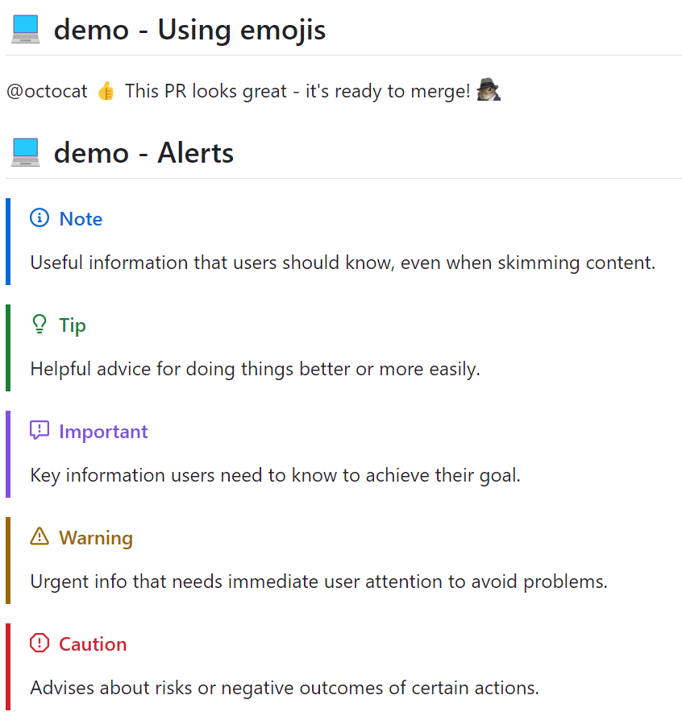

# [0001. Writing on GitHub](https://github.com/Tdahuyou/markdown/tree/main/0001.%20Writing%20on%20GitHub)


<!-- region:toc -->
- [1. 📝 summary](#1--summary)
- [2. 🔗 links](#2--links)
- [3. 📒 notes - github 对传统的 markdown 做了一些扩展](#3--notes---github-对传统的-markdown-做了一些扩展)
- [4. 💻 demo - Using emojis](#4--demo---using-emojis)
- [5. 💻 demo - Alerts](#5--demo---alerts)
- [6. 🤖 AI - `- https://docs.github.com/en/get-started/writing-on-github`](#6--ai-----https//docsgithubcom/en/get-started/writing-on-github)
  - [6.1. 主要内容包括：](#61-主要内容包括)
<!-- endregion:toc -->

## 1. 📝 summary
  - GitHub 对 Markdown 进行了扩展，有些写法是 GitHub 上特定支持的，在本地编写 markdown 时也许看不到效果。

## 2. 🔗 links

- https://docs.github.com/en/get-started/writing-on-github
  - Writing on GitHub
  - You can structure the information shared on GitHub with various formatting options.
- https://docs.github.com/en/get-started/writing-on-github/getting-started-with-writing-and-formatting-on-github/basic-writing-and-formatting-syntax
  - Create sophisticated formatting for your prose and code on GitHub with simple syntax.
    - sophisticated adj. 复杂的
    - prose n. 乏味的话；adj. 单调的，乏味的

## 3. 📒 notes - github 对传统的 markdown 做了一些扩展

- 以本节的俩 demo 为例，如果在本地展示的话，效果如下：
  - 
  - 这使用的是 VSCode 中的 markdown preview enhanced 插件来预览 markdown 的效果截图。
- 如果上传到 github 上，展示效果如下：
  - 

## 4. 💻 demo - Using emojis

@octocat :+1: This PR looks great - it's ready to merge! :shipit:

## 5. 💻 demo - Alerts

> [!NOTE]
> Useful information that users should know, even when skimming content.

> [!TIP]
> Helpful advice for doing things better or more easily.

> [!IMPORTANT]
> Key information users need to know to achieve their goal.

> [!WARNING]
> Urgent info that needs immediate user attention to avoid problems.

> [!CAUTION]
> Advises about risks or negative outcomes of certain actions.

## 6. 🤖 AI - `- https://docs.github.com/en/get-started/writing-on-github`

```
- https://docs.github.com/en/get-started/writing-on-github
  - Writing on GitHub
  - You can structure the information shared on GitHub with various formatting options.

你知道这个吗？
```

是的，我了解 GitHub 提供的文档编写功能。GitHub 不仅是一个代码托管平台，它还提供了一套强大的工具来帮助用户编写和格式化文档。在你提到的链接 [Writing on GitHub](https://docs.github.com/en/get-started/writing-on-github) 中，GitHub 官方文档详细介绍了如何使用 Markdown 以及其他一些特性来编写内容。

### 6.1. 主要内容包括：

1. **Markdown 基础**:
   - GitHub 支持标准的 Markdown 语法，允许用户创建结构化的文本，如标题、列表、链接、图片等。
   - 这使得编写 README 文件、ISSUE 描述、评论等变得更加容易且格式化。
2. **扩展的 Markdown 功能**:
   - GitHub 对 Markdown 进行了扩展，增加了诸如任务列表、表格、脚注、定义列表等额外的功能。
   - 用户可以使用这些扩展功能来增强文档的表现力。
3. **高级格式选项**：
   - GitHub 支持使用 HTML 来进一步定制文档的样式和布局。
   - 例如，你可以使用 `<picture>` 元素结合 `prefers-color-scheme` 来显示适应不同主题模式的图片，就像我们之前讨论的那样。
4. **自动链接**:
   - GitHub 会自动将某些 URL 和引用转换为链接，比如提及用户名、问题编号、提交哈希等。
5. **相对链接和锚点**:
   - 你可以在同一个仓库内使用相对路径来链接文件，还可以使用锚点直接链接到页面中的特定部分。
6. **表情符号**:
   - GitHub 支持使用简短的代码（如 `:smile:`）来插入表情符号，这可以使你的文档更加生动有趣。
7. **数学公式**:
   - 通过使用 TeX 或 LaTeX 语法，GitHub 支持在 Markdown 中渲染数学公式。
8. **附件**:
   - 你可以将图像和其他文件附加到仓库中，并在 Markdown 文档中引用它们。
9. **查看差异**:
   - 当你在 GitHub 上编辑文件时，可以预览 Markdown 渲染后的效果，并查看与上一个版本的差异。
10. **写作指南**:
    - GitHub 提供了一些关于如何撰写清晰、有效的文档的最佳实践建议。

如果你需要具体的示例或更详细的解释，或者想要了解更多关于某个特定功能的信息，请告诉我，我可以提供更多的帮助。