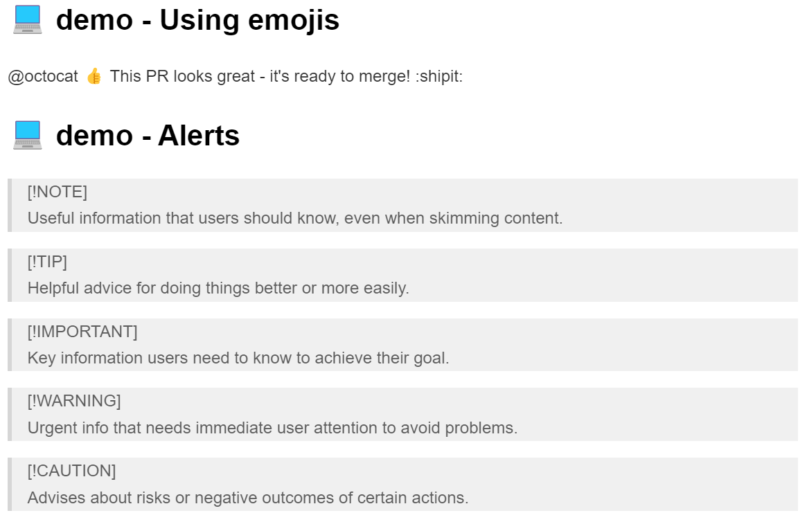

# [0001. Writing on GitHub](https://github.com/Tdahuyou/markdown/tree/main/0001.%20Writing%20on%20GitHub)

<!-- region:toc -->
- [1. 📝 summary](#1--summary)
- [2. 🔗 links](#2--links)
- [3. github 对传统的 markdown 做了一些扩展](#3-github-对传统的-markdown-做了一些扩展)
- [4. 💻 demo - Using emojis](#4--demo---using-emojis)
- [5. 💻 demo - Alerts](#5--demo---alerts)
- [6. 🤖 AI - `- https://docs.github.com/en/get-started/writing-on-github`](#6--ai-----https//docsgithubcom/en/get-started/writing-on-github)
  - [6.1. 主要内容包括：](#61-主要内容包括)
<!-- endregion:toc -->
- GitHub 对 Markdown 进行了扩展，有些写法是 GitHub 上特定支持的，在本地编写 markdown 时也许看不到效果。这篇笔记所记录的内容，其实就是一部分 Github 上支持的 markdown 的特殊语法。
- 如果在 github 上查看其他人写的文档时，发现一些特殊的效果不知道如何使用 markdown 来编写，那么可以到 [Writing on GitHub](https://docs.github.com/en/get-started/writing-on-github) 这篇官方提供的文档中找找看相应的语法介绍。比如下面这些 Alerts
  - 

## 2. 🔗 Writing on GitHub

- https://docs.github.com/en/get-started/writing-on-github
  - Writing on GitHub
  - You can structure the information shared on GitHub with various formatting options.
  - GitHub 官方文档详细介绍了如何使用 Markdown 以及其他一些特性来编写内容。
- https://docs.github.com/en/get-started/writing-on-github/getting-started-with-writing-and-formatting-on-github/basic-writing-and-formatting-syntax
  - Create sophisticated formatting for your prose and code on GitHub with simple syntax.
    - sophisticated adj. 复杂的
    - prose n. 乏味的话；adj. 单调的，乏味的

## 3. 📒 github 对传统的 markdown 做了一些扩展

- 以本节的俩 demo 为例，如果在本地展示的话，效果如下：
  - 
  - 这使用的是 VSCode 中的 markdown preview enhanced 插件来预览 markdown 的效果截图。
- 如果上传到 github 上，展示效果如下：
  - 

## 4. 💻 Using emojis

@octocat :+1: This PR looks great - it's ready to merge! :shipit:

## 5. 💻 Alerts

> [!NOTE]
> Useful information that users should know, even when skimming content.

> [!TIP]
> Helpful advice for doing things better or more easily.

> [!IMPORTANT]
> Key information users need to know to achieve their goal.

> [!WARNING]
> Urgent info that needs immediate user attention to avoid problems.

> [!CAUTION]
> Advises about risks or negative outcomes of certain actions.
