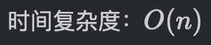
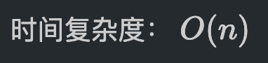
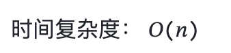

# [0002. 在 GitHub 上编写内联公式需要和中文字符区分开](https://github.com/Tdahuyou/markdown/tree/main/0002.%20%E5%9C%A8%20GitHub%20%E4%B8%8A%E7%BC%96%E5%86%99%E5%86%85%E8%81%94%E5%85%AC%E5%BC%8F%E9%9C%80%E8%A6%81%E5%92%8C%E4%B8%AD%E6%96%87%E5%AD%97%E7%AC%A6%E5%8C%BA%E5%88%86%E5%BC%80)


<!-- region:toc -->
- [1. 📝 summary](#1--summary)
- [2. 🔗 links](#2--links)
- [3. 📒 notes - 公式在 GitHub 上无法正常渲染的情况](#3--notes---公式在-github-上无法正常渲染的情况)
<!-- endregion:toc -->

## 1. 📝 summary
  - 该笔记记录了在 GitHub 上渲染数学公式的一个注意事项。

## 2. 🔗 links

- https://docs.github.com/zh/get-started/writing-on-github/working-with-advanced-formatting/writing-mathematical-expressions
  - GitHub doc - 编写数学表达式 - 使用 Markdown 在 GitHub 上显示数学表达式。

## 3. 📒 notes - 公式在 GitHub 上无法正常渲染的情况

- 如果你在使用 Latex 格式来书写内联公式，那么可以使用 `$` 来包裹公式。但是需要注意的是，在 GitHub 上如果要正常渲染，需要确保 `$` 和中文字符区分开，即 —— 加空格。

- 不加空格的写法：
```
时间复杂度：$O(n)$
```
时间复杂度：$O(n)$
- 在本地看到的结果：
- 在 GitHub 上看到的结果：

---

- 加空格的写法：
```
时间复杂度： $O(n)$
```
时间复杂度： $O(n)$
- 在本地看到的结果：
- 在 GitHub 上看到的结果：
